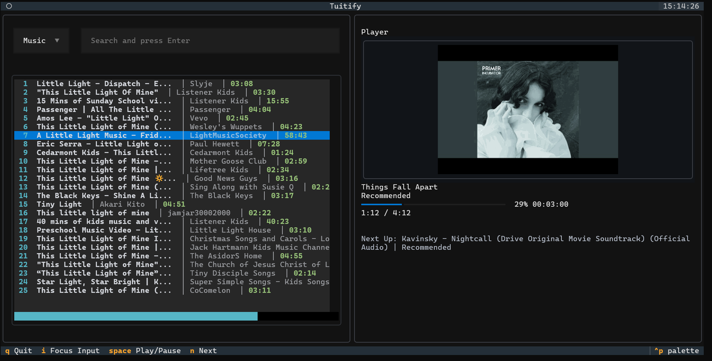

<div align="center">
  
</div>

<p align="center">
  <strong>Terminal-first streaming engine with smart autoplay radio.</strong>
</p>

---

[](https://www.python.org/downloads/)
[](https://github.com/astral-sh/uv)
[](https://opensource.org/licenses/MIT)

## Overview

**Tuitify** is a terminal-first music streaming application built for users who want a fast, keyboard-driven listening experience without leaving the command line. It combines YouTube-powered music discovery, seamless playback, and radio-style autoplay recommendations into a lightweight TUI (Text User Interface) that feels like a minimal Spotify for the terminal.

Users can search for music or podcasts, instantly stream audio using VLC-backed playback, and continue listening through an automatically generated recommendation queue based on the currently playing track. Album artwork, progress tracking, next-up previews, playback controls, and keyboard shortcuts make the experience smooth, responsive, and practical for daily use.



## Why Tuitify?

Most terminal music players focus only on local files. Tuitify is built for streaming-first listening. Listen your favourite music and podcasts without leaving the terminal.

The goal is simple: minimal friction, continuous listening, and a terminal-native music experience, no more ads, no more interruptions, just the freedom to enjoy your music seamlessly from your command line.

As a contributor to [SimpMusic](https://github.com/maxrave-dev/SimpMusic), I’ve seen how a simple and seamless streaming experience can completely change the way people listen to music. Tuitify brings that same idea to the terminal-a lightweight, keyboard-first music player that keeps playback smooth, fast, and uninterrupted.


## Features

- **Global Search**: Instantly find songs, albums, or podcasts.
- **Smart Radio Engine**: Automatically seeds recommendations based on your current track for non-stop playback.
- **High-Quality Audio**: Uses `yt-dlp` and `vlc` for reliable and high-quality streaming.
- **Keyboard Centric**: Optimized for efficiency with customizable keybindings.
- **Album Art**: Real-time display of track artwork in your terminal.

### Support Matrix

| Terminal            | TGP support | Sixel support | Works with textual-image |
|---------------------|:-----------:|:-------------:|:------------------------:|
| Black Box           |          ❌ |            ✅ |                       ✅ |
| foot                |          ❌ |            ✅ |                       ✅ |
| GNOME Terminal      |          ❌ |            ❌ |                          |
| iTerm2              |          ❌ |            ✅ |                       ✅ |
| kitty               |          ✅ |            ❌ |                       ✅ |
| konsole             |          ✅ |            ✅ |                       ✅ |
| tmux                |          ❌ |            ✅ |                       ✅ |
| Visual Studio Code  |          ❌ |            ✅ |                       ✅ |
| Warp                |          ❌ |            ❌ |                       ❌ |
| wezterm             |          ✅ |            ✅ |                       ✅ |
| Windows Console     |          ❌ |            ❌ |                          |
| Windows Terminal    |          ❌ |            ✅ |                       ✅ |
| xterm               |          ❌ |            ✅ |                       ✅ |

✅ = Supported; ❌ = Not Supported

## Getting Started

### Prerequisites
- **Python 3.12+**
- **VLC Media Player**: Ensure VLC is installed on your system as it's the core playback engine.


### Installation

1. Clone the repository:
   ```bash
   git clone https://github.com/Hemanth2332/tuitify.git
   cd tuitify
   ```

2. Install dependencies (using `uv` or `pip`):
   ```bash
   uv sync
   # or
   pip install .
   ```

### Running the App

Simply run the `main.py` file:
```bash
uv run ./main.py
```

## Controls

- `i`: Focus search input
- `Enter`: Search / Play selected track
- `Space`: Play / Pause
- `n`: Skip to next track
- `tab`: switch between panels
- `←` / `→`: Seek backward/forward (10s)
- `q`: Quit Tuitify

Feel Free to change the keybindings to your own preference in `src/tui/keybindings.py`.

# Single binary file Support:
Added support for binary file. You can download the binary from Releases

Use this command to create a single binary file from source.

For Windows:
```bash
uv run pyinstaller --onefile --add-data "src/tui/styles.tcss;src/tui" main.py
```

For Linux and Mac:
```bash
uv run pyinstaller --onefile --add-data=src/tui/styles.tcss:src/tui main.py
```

## Project Structure

- `src/tui/`: Main TUI application logic and layout.
- `src/youtube/`: YouTube service, streaming player, and recommendation engine.
- `src/search/`: Search-specific wrappers.

## Contribution

Tuitify is built to grow, and contributions are always welcome.

If you'd like to contribute:

1. Fork the repository
2. Create a new branch (`feature/your-feature-name`)
3. Commit your changes
4. Open a Pull Request

Ideas, discussions, and improvements are always appreciated.

## License

This project is licensed under the MIT License - see the [LICENSE](LICENSE) file for details.
